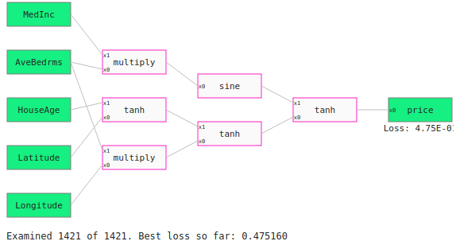
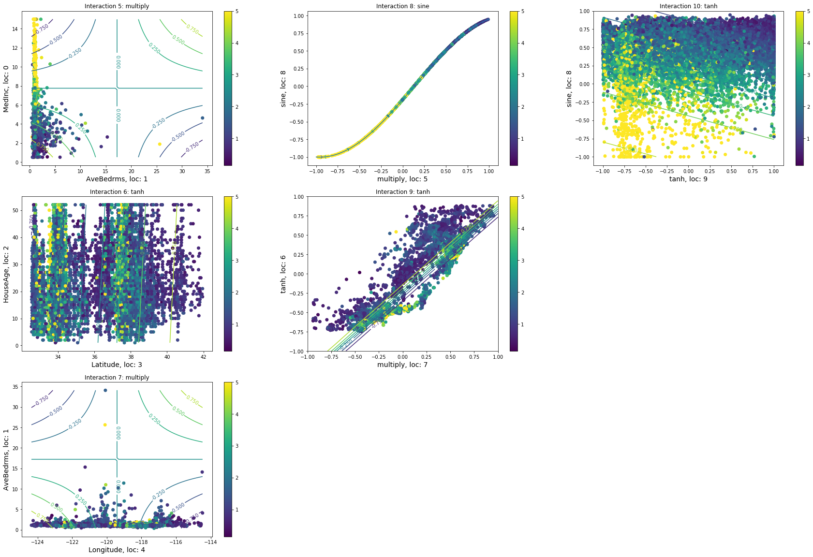
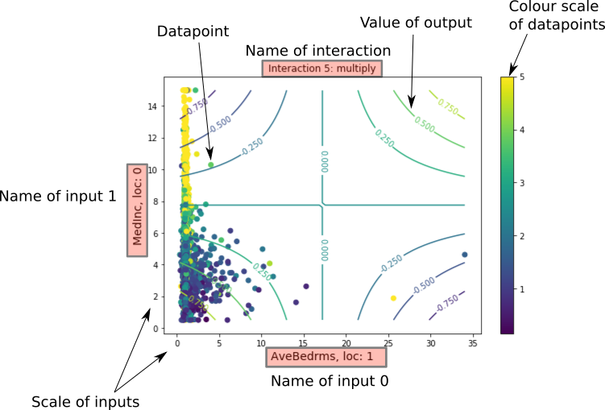

# Feynplots
Feynplots is a package to visualise each interaction in a Feyn Graph. This is an extra to Feyn and the QLattice. See [here for more on starting with Feyn](https://docs.abzu.ai/docs/guides/quick_start.html) and [understanding the QLattice.](https://docs.abzu.ai/docs/guides/qlattice.html)

## Install
This can be installed from [PyPi.](https://pypi.org/project/feynplots/)
```
richard@feyn:~$ pip install feynplots
```


## About
Every interaction in a Feyn Graph has either one or two input variables. This means that every interaction can be represented in a two dimensional plot.

When an interaction has one input then the axis of the plot is the input on the x-axis and the output on the y-axis.

When an interaction has two inputs then the axes of the plot are both inputs and then the contour lines represent the output of the interaction.

The purpose of this package is to return a figure that contains every plot of each interaction in a Feyn Graph.

## Use
The following demonstrates how to use the package in a full workflow with the QLattice. We use the California housing dataset as an example.
```python
import feyn
from feyn import tools
from feynplots import GraphPlot

import sklearn.datasets
import pandas as pd
import numpy as np

#Importing the dataset from sklearn and turning it into a Pandas DataFrame
dataset = sklearn.datasets.fetch_california_housing()
data = pd.DataFrame(data=dataset.data,columns=dataset.feature_names)
price = pd.DataFrame(data=dataset.target, columns = ['price'])
cal_housing = pd.concat([data,price],axis=1)

#Splitting into a train and test set
train, test = tools.split(cal_housing,ratio=[4,1])

#Here you would input your url and api token
ql = feyn.QLattice(url='Your unique url here', api_token='Your unique api token here')
ql.reset()

#Adding registers
for cols in cal_housing.columns:
    ql.get_register(name=cols)
    
#Extract, fit, update and repeat
updates = 10
epochs = 15
target = 'price'
for loop in range(updates):
    qgraph = ql.get_qgraph(train.columns,target,max_depth=3)
    qgraph.fit(train,epochs = epochs,threads = 5)
    best = qgraph.select(train,n=1)[0]
    ql.update(best)
    
#This is the graph we will plot
best = qgraph.select(train, n = 1)[0]

#Using the package feynplots. First initiates the instance with a Feyn graph
graphplot = GraphPlot(best) 

#evaluates every interaction at every datapoint in a pandas DataFrame
graphplot.graph_eval(train)

#plots the figure the includes every interaction
fig = graphplot.plot(figsize = (30,20)) 
```
To plot a different dataset,graphplot needs to be evaluated on the different dataset before it can be plotted.
```
graphplot = GraphPlot(best) 
graphplot.graph_eval(dataset1)
fig = graphplot.plot(figsize = (30,20))
...
#if you want to plot another dataset with the same graph then first it needs to be evaluated with the new dataset
graphplot.graph_eval(dataset2)
fig2 = graphplot.plot(figsize = (30,20))
```
## Details of plot
Here we explain the output of the function GraphPlot.plot(). It is a matplotlib figure that contains every plot of every interaction in the Feyn Graph. We will start off with an example of a Feyn Graph: 

```python
example = ql.select(train, n = 1)[0]
example
```
 

Now we see the graph plot
```python
graphplot = GraphPlot(example)
graphplot.graph_eval(train)
fig = graphplot.plot(figsize = (30,20)) 
```
 

Observe how the positioning of the plots in the figure matches the location of the interactions in the graph. Below is an annotation and a description of a plot of an interaction with two inputs

 

* The title of the plot is the name and location in the graph of the interaction. In this case it is a *multiply* interaction and is at *location 5* in the graph.
* The label of each axis is the name of the input and their location in the graph. In this case it is *AveBedrms* and *MedInc*.
* The scale of each axis is the scale of the input.
* The lines are the values of the output. This is a [contour plot](https://en.wikipedia.org/wiki/Contour_line) where the 'height' of the plot represents the value of the output of the interaction.
* A datapoint is represented by an 'o'. By default the colour scale of each datapoint is the actual value of the target variable.

There's a very important point to make here. Feyn graphs automatically performs MinMaxScalar to standardise the inputs to be between -1 and 1 and then destandardise the output using MinMaxScalar to be between the target variable ranges.

However these plots do not show the above standardisation. When an interaction takes an input from a feature variable, the scale on the axes are taken from the feature range and **not** the standardised range of [-1,1]. The output of these plots **are** evaluated at the standardised feature value. Likewise the output scale of the final interaction is on the scale of the target feature, not the standardised feature.

The purpose of this is to make the plots more readable and show datapoints on the scale that are more recognisable than the standardised scale

For interactions within the hidden layer, this is not a problem because each interaction takes values in the interval [-1,1] and outputs values in the interval [-1,1].

The case for interactions that take only one input, the plots are very similar. The main difference is that the y-axis is the output value and the line is the line plot of the function across the range of the input.
