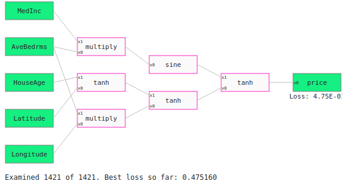
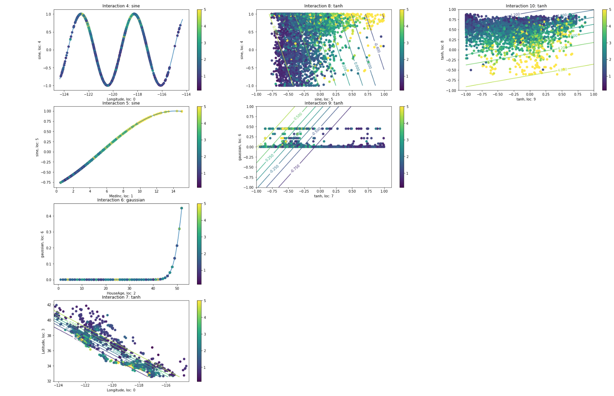

# Feynplots
A package to see what's going on inside graphs produced from a QLattice. A QLattice is a quantum mechanics simulator produced by [Abzu](https://www.abzu.ai/) that produces models for datasets in an evolutionary process. [You can read more about the QLattice here](https://docs.abzu.ai/docs/guides/qlattice.html). Feyn is the package used to interact with the QLattice and you can find more about [getting started with it here](https://docs.abzu.ai/docs/guides/quick_start.html).

A graph produced from the QLattice typically looks like so



This is a model for the California housing dataset. Each interaction takes either one or two variables as input and has a single output. This means that we can plot each interaction. Let's do that!


Here's a couple of comments on this plot
Each dot corresponds to a datapoint in the training set. The colour corresponds to the actual value of the target variable.
The x-axis corresponds to the variable x0;
The y-axis corresponds to the variable x1;
The scale on each axis the scale of each feature;
The contour lines correspond to the value of the output at the (x0,x1) coordinate.

Here's a small summary of how to use this package.

```python
from feynplots import GraphChart

graphplot = GraphChart(g) #initiates the chart instance
graphplot.model_ev(data) #evaluates every interaction at every datapoint

graphplot.plot(figsize = (30,20)) #plots the figure
```